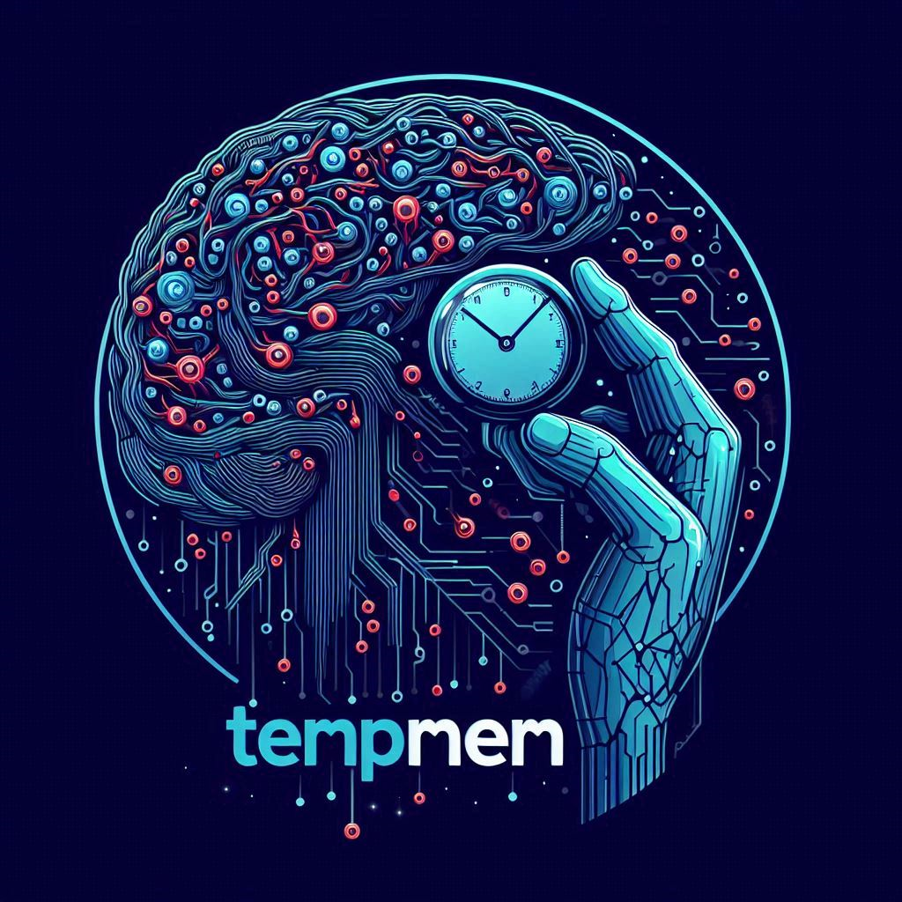

# initial instructions for database creation

# TempMem Framework - Initial Setup Guide

This guide will walk you through the steps to set up and initialize the TempMem framework, including installing dependencies and preparing the database using Flask.

## 1. Install Dependencies

Ensure you have Python installed, and then install the required dependencies by running:
```bash
pip install spacy
python -m spacy download en_core_web_sm
```

```bash
pip install -r requirements.txt
```

## 2. Set Up Flask Application

Set the `FLASK_APP` environment variable in your project directory:

```bash
export FLASK_APP=app.py
```

## 3. Initialize the Database

Initialize the SQLite database, which creates the necessary migration directory.

```bash
flask db init
```

## 4. Create Migrations

Generate migrations based on your data models:

```bash
flask db migrate -m "Initial migration"
```

## 5. Apply Migrations

Apply the migrations to create the necessary tables in your database:

```bash
flask db upgrade
```

This will create tables such as `Event` and `Memory` in the SQLite database.

## 6. Run the Application

Start the Flask application by running:

```bash
python app.py
```

## 7. Optional: View Your Data

If you'd like to view your SQLite database, you can use tools such as [DB Browser for SQLite](https://sqlitebrowser.org/).

---

Once these steps are complete, your TempMem framework will be ready to use, and you can begin interacting with it through the web interface and Flask-powered backend.

```


# TempMem AI Framework

**TempMem** is an advanced AI framework designed to emulate temporal memory and spatial awareness. Built on Flask and the Ollama framework, TempMem offers AI the ability to recall events with a precise awareness of time, making it a highly versatile and efficient memory system.

## Features
- **Temporal Awareness**: The AI can recall sequential events with their associated time periods, offering a depth of understanding that goes beyond traditional memory frameworks like Mem0.
- **Real-time Event Tracking**: Log events and memories as they occur, with a user-friendly web UI for viewing scheduled events and reviewing memory logs.
- **Ollama Integration**: Powered by Ollama's AI models, providing fast and efficient interactions.

## Installation

1. **Run the Flask Web UI**:
   To launch the web UI, execute the following command in your terminal:
   ```bash
   python app.py
   ```

2. **Start AI Interaction**:
   Once the web UI is running, interact with your AI by executing:
   ```bash
   python ai-script.py
   ```
   Ensure your Ollama framework is installed and running, and that the endpoint in the AI script is set to:
   ```
   http://localhost:11434/api/chat
   ```

3. **Access the Web UI**:
   - **Event Viewer**: View scheduled events by navigating to:
     ```
     http://127.0.0.1:5000
     ```
   - **Memory Log**: To review your AI’s memory logs, navigate to:
     ```
     http://127.0.0.1:5000/memories
     ```

## Why TempMem?

TempMem offers a unique advantage by incorporating **temporal awareness**. Unlike other frameworks such as Mem0, TempMem enables AI to recall events with a clear understanding of when the event occurred, enhancing its ability to manage and reference past events with precision. 

### Key Highlights:
- **Time Awareness**: The AI doesn’t just remember events, but also understands the time context in which they happened.
- **Enhanced Memory Recall**: TempMem allows the AI to sequentially recall past messages and events, offering richer and more context-aware responses.

---
